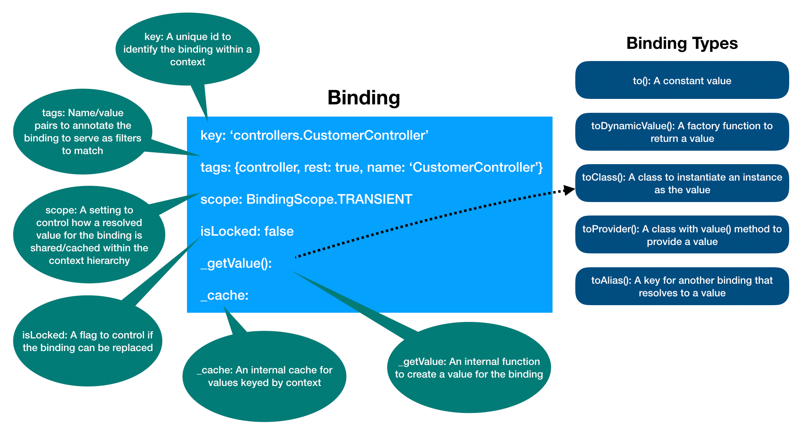

## 什么是`Binding`?

> Binding译为“绑定”，下略。

`Binding`可以在一个实例化后的[`Context（上下文）`](Context.md)中作为一个或多个对象的代表。一个`Binding`使用一个不重复的键作为地址，在`Context`中可以通过此地址获取到`Binding`所对应的值。

### `Binding`的属性

一个`Binding`通常拥有以下属性：

- key（键）: 在上下文中，每个`Binding`都有一个用于标记自己的唯一键；
- scope（范围）: 在上下文中，用来控制如何创建或缓存`Binding`的值；
- tags（标签）: 可以是`名称`字符串或`名称-值`键值对，用来描述或注释一个`Binding`；
- value（值）: 每个`Binding`必须设置一个可以解析出绑定的值的提供装置（比如，类、方法、常量等），这样`Binding`才可以被解析成一个常量或动态值；



## 如何创建一个`Binding`？

有几种方式可以创建一个`Binding`：

- 使用`Binding`类的构造器

  ```ts
  import {Context, Binding} from '@loopback/core';
  // 实例化一个上下文
  const context = new Context();
  // 实例化一个绑定，并将其'key'属性设置为'my-key'
  const binding = new Binding('my-key');
  // 将绑定添加至上下文中
  ctx.add(binding);
  ```

- 使用`Binding`类的`.bind()`静态方法

  ```ts
  import {Context, Binding} from '@loopback/core';
  // 实例化一个上下文
  const context = new Context();
  // 实例化一个绑定，并将其'key'属性设置为'my-key'
  const binding = Binding.bind('my-key');
  // 将绑定添加至上下文中
  ctx.add(binding);
  ```

- 使用`Context`类的`.bind()`方法

  ```ts
  import {Context, Binding} from '@loopback/core';
  // 实例化一个上下文
  const context = new Context();
  // 在上下文中添加一个绑定，并将其'key'属性设置为'my-key'
  context.bind('my-key');
  ```

  

## 如何设置一个`Binding`?

`Binding`类通过一套流畅的API提供了有关`Binding`的创建和配置的操作。

### 解析一个绑定的值的形式

绑定可以通过多种形式以解析出一个具体的值。具体如下：

#### 常量形式（Constant）

适用场景：在解析一个绑定时，绑定的值是一个固定的值。<br/>
比如，绑定的值是一个字符串（String）、一个方法（Function）、一个对象（Object）、一个数组（Array）或者任何其他类型的值。

```ts
binding.to('my-value');
```

请注意，在常量形式下为了避免混淆，值的类型不能是`Promise`。

#### 工厂形式（Factory Function）

适用场景：在解析一个绑定时，绑定的值是需要被动态计算的。<br/>
比如，绑定的值是当前系统时间、绑定的值是远程接口的返回值、绑定的值是远程数据库的数据等。

```ts
binding.toDynamicValue(() => 'my-value');
binding.toDynamicValue(() => new Date());
binding.toDynamicValue(() => Promise.resolve('my-value'));
```

工厂方法可以接收一个涵盖了上下文信息、绑定信息和解析选项信息的参数。

```ts
import {ValueFactory} from '@loopback/core';

// 现在可以通过工厂方法的第一个传参获取到解析时的相关信息了
const factory: ValueFactory<string> = resolutionCtx => {
  return `Hello, ${resolutionCtx.context.name}#${
    resolutionCtx.binding.key
  } ${resolutionCtx.options.session?.getBindingPath()}`;
};
const b = ctx.bind('msg').toDynamicValue(factory);
```
通过[ 解构赋值（Destructuring assignment）](https://developer.mozilla.org/zh-CN/docs/Web/JavaScript/Reference/Operators/Destructuring_assignment)
可以进一步简化并快速访问到`context`、`binding`和`options`等对象。 

```ts
const factory: ValueFactory<string> = ({context, binding, options}) => {
  return `Hello, ${context.name}#${
    binding.key
  } ${options.session?.getBindingPath()}`;
};
```

进阶用法：使用内置了静态方法`value`的类，该静态方法允许参数注入。（具体见`提供器形式（Provider）`）

```ts
import {inject} from '@loopback/core';

class GreetingProvider {
  static value(@inject('user') user: string) {
    return `Hello, ${user}`;
  }
}

const b = ctx.bind('msg').toDynamicValue(GreetingProvider);
```

#### 类形式（Class）

适用场景：在解析一个绑定时，绑定的值是一个类的实例化对象。<br/>
比如，控制器（Controller）等。绑定的值可以是一个被实例化的类。依赖注入通常用于影响被注入依赖的类的内部成员对象身上。

```ts
class MyController {
  constructor(@inject('my-options') private options: MyOptions) {
    // ...
  }
}

binding.toClass(MyController);
```

#### 提供器形式（Provider）

适用场景：在解析一个绑定时，用于解析绑定的值的工厂方法需要用到依赖注入（Dependency Injection）。<br/>
提供器指的是，内置了`value()`方法的类，该方法可以在实例化后用来解析绑定的值。

```ts
class MyValueProvider implements Provider<string> {
  constructor(@inject('my-options') private options: MyOptions) {
    // ...
  }

  value() {
    return this.options.defaultValue;
  }
}

binding.toProvider(MyValueProvider);
```

提供器被当做一个内置了依赖注入功能的空壳，可以理解为是一个进阶版本的工厂方法。如果工厂方法没有使用到依赖注入，则直接使用普通的工厂方法和`toDynamicValue()`方法即可。

#### 同族形式（Alias）

适用场景：在解析一个绑定时，此绑定的值的来源是另外一个绑定的值。<br/>
同族指的是，一个允许携带可选路径的键值，这个键值可以用来从另外一个绑定上解析出值。
比如，我们在设置`Api Explorer（API浏览页面）`的时候，需要用到`RestServer`对象的相关属性，我们可以创建一个绑定并将这个绑定通过`.toAlias()`方法设置为`key`为`servers.RestServer.options#apiExplorer`的绑定的同族。

```ts
// 创建`key`为`servers.RestServer.options`的绑定
ctx.bind('servers.RestServer.options').to({apiExplorer: {path: '/explorer'}});
// 创建`key`为`apiExplorer.options`的绑定
ctx
  .bind('apiExplorer.options')
// 声明此绑定是`key`为`servers.RestServer.options`的绑定的同族
  .toAlias('servers.RestServer.options#apiExplorer');
const apiExplorerOptions = await ctx.get('apiExplorer.options'); // => {path: '/explorer'}
```
