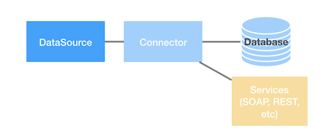

## 总览

在 LoopBack 4 中，`DataSource`（数据源）是一个连接器（Connector）实例的命名配置，它代表了一个外部系统的数据。连接器（Connector）用于`legacy-juggler-bridge` （传统映射桥）以驱动 LoopBack 4 的存储库（Repositories）进行数据操作。



### 创建一个数据源（DataSource）

建议使用 CLI 提供的[`lb4 datasource`命令](DataSource-generator.md)来生成数据源（DataSource）。CLI 会提示全部必要的的连接器信息，并创建下列文件：

- `${dataSource.dataSourceName}.datasource.json` 包含了连接器（Connector）。
- `${dataSource.dataSourceName}.datasource.ts` 包含了扩展了`juggler.DataSource`的类。这个类可以用于编程覆写默认的数据源（DataSource）行为。
  注意：这个连接器配置存储在`.json`文件，并使用[依赖注入（Dependency Injection）](Dependency-injection.md)注入到类中。

CLI 会将上述两个文件生成在`src/datasources/`目录中。
它同时也会更新`src/datasources/index.ts`来导出新的数据源（DataSource）类。

数据源（DataSource）类示例如下：

```ts
import { inject } from "@loopback/core";
import { juggler } from "@loopback/repository";
import * as config from "./db.datasource.json";

export class DbDataSource extends juggler.DataSource {
  static dataSourceName = "db";

  constructor(
    @inject("datasources.config.db", { optional: true })
    dsConfig: object = config
  ) {
    super(dsConfig);
  }
}
```
