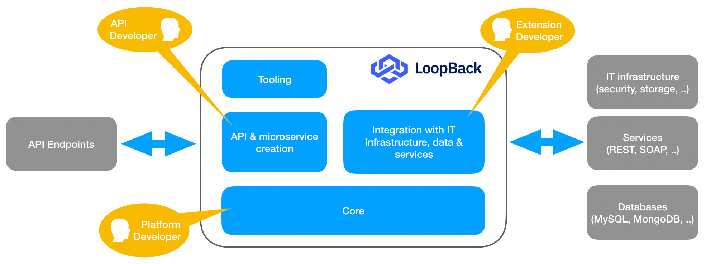





LoopBack是高扩展性、开源的Node.js框架，基于Express，使得开发者可以快速创建由后端系统（例如数据库、SOAP或REST服务等）组成的API和微服务。

下图展示了LoopBack如何充当传入请求和传出集成之间的桥梁。它还显示了对各种由LoopBack提供的功能感兴趣的不同角色。

```

```

## 为 API 开发者创建

 - 使用 [OpenAPI](https://www.openapis.org/) 标准定义你的 API 服务端和模式。
 - 使用 ES2017, `async` / `await`, modules 等现代 JavaScript 特性编写你的服务端。
 - 真正的“无需生成代码“便可使用你定义的服务端和模式。

## 为团队协作创建

 - 无需查阅JavaScript代码即可查阅API变化。
 - 自动校验服务端和模式的一致性。
 - 优先支持 [TypeScript](https://www.typescriptlang.org) (强类型的JavaScript)。

## 为你的平台创建

 - 以LoopBack作为你自己的框架或平台的起点.
 - 以标准的方式创建可复用的组件库。
 - 使用connectors集成数据库、web服务和其他平台。

